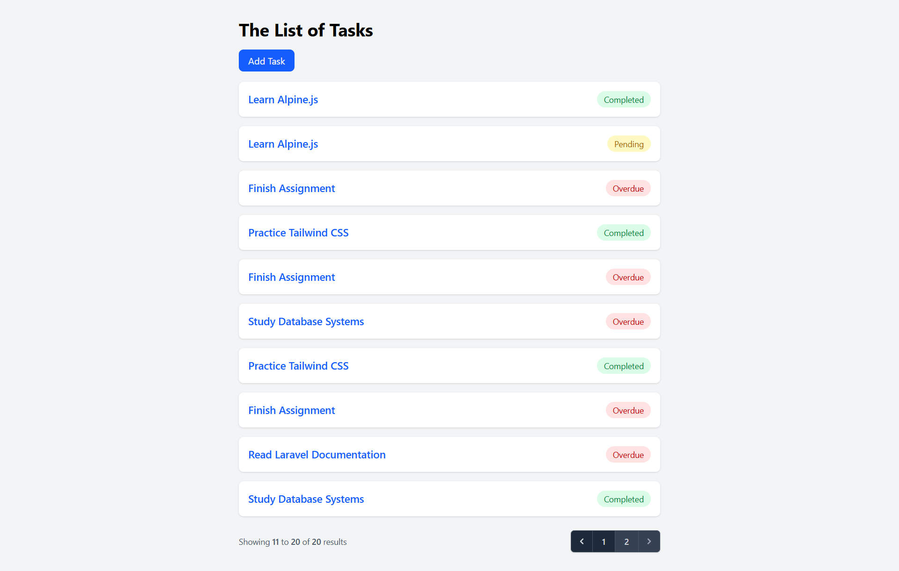
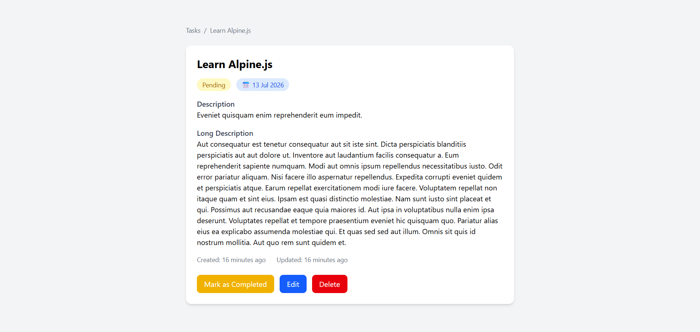
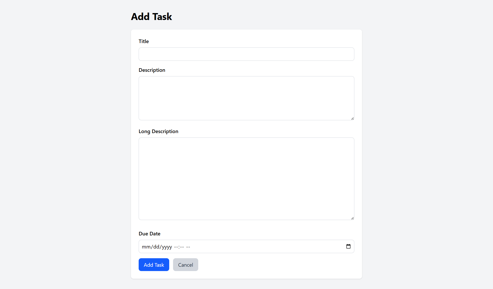
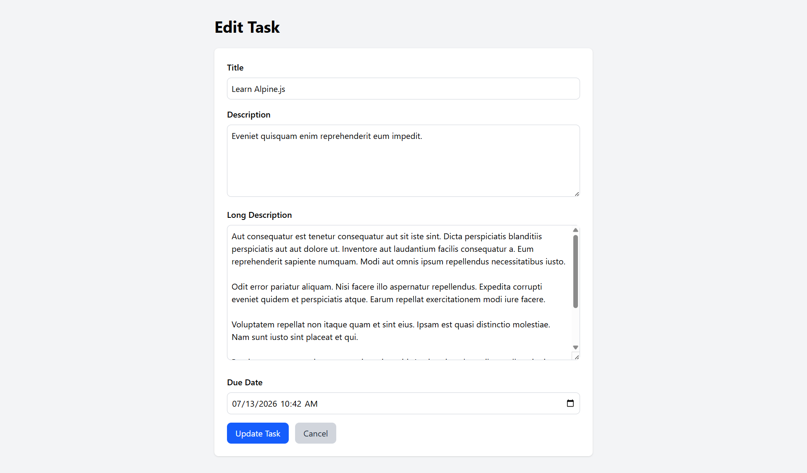

# Task List Application

A modern Task Management application built with Laravel 13, Tailwind CSS, and Alpine.js.

## Repository

https://github.com/Amjad-Alkahlout/task-list-laravel

## Features

* Create, Read, Update, and Delete tasks (CRUD)
* Mark tasks as completed or pending
* Due date support
* Automatic overdue task detection
* Pagination
* Flash success messages
* Form validation using Form Requests
* Route Model Binding
* Mass Assignment protection
* Reusable Blade form components
* Delete confirmation modal using Alpine.js
* Responsive UI with Tailwind CSS

---

## Technologies Used

* PHP 8+
* Laravel 13
* MySQL
* Blade Templates
* Tailwind CSS
* Alpine.js
* Vite
* Git & GitHub

---

## Screenshots

### Task List



### Task Details


### Create / Edit Task



---

## Installation

Clone the repository:

```bash
git clone https://github.com/Amjad-Alkahlout/task-list-laravel.git
```

Move into the project directory:

```bash
cd task-list-laravel
```

Install dependencies:

```bash
composer install
npm install
```

Create environment file:

```bash
cp .env.example .env
```

Generate application key:

```bash
php artisan key:generate
```

Configure your database inside `.env`.

Run migrations:

```bash
php artisan migrate
```

Start the development server:

```bash
php artisan serve
```

Run Vite:

```bash
npm run dev
```

Visit:

```text
http://localhost:8000
```

---

## Learning Concepts Applied

This project was built while learning Laravel fundamentals and includes:

* Routing
* Blade Templates
* Layouts & Partials
* Eloquent ORM
* Query Builder
* Form Requests
* Validation
* Route Model Binding
* Mass Assignment
* Pagination
* Tailwind CSS
* Alpine.js

---

## Future Improvements

* Task priorities (Low / Medium / High)
* Search functionality
* Task filtering
* User authentication
* Dashboard statistics
* Dark mode
* Task categories

---

## Author

**Amjad Alkahlout**

Computer Science Engineering Student

Built as part of my Laravel learning journey.
